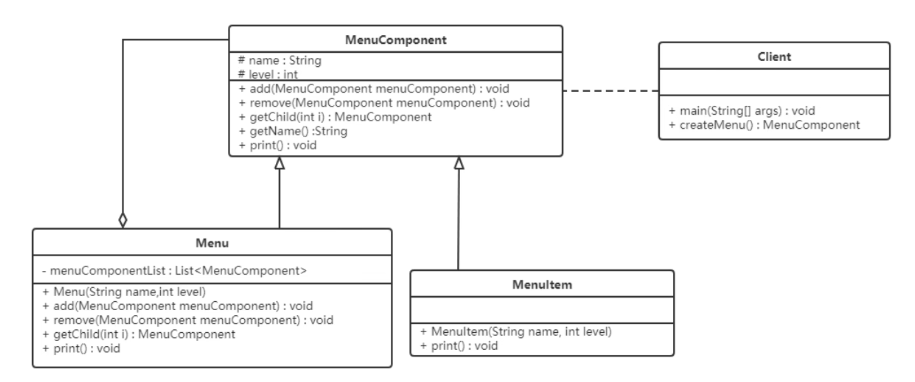

### 组合模式

组合模式用于把一组相似的对象当作一个单一的对象。组合模式依据树形结构来组合对象，用来表示部分以及整体层次。

#### 结构
- 抽象根节点：定义系统各层次对象的共有方法和树形，可以预先定义一些默认行为和属性
- 树枝节点：定义树枝节点的行为，存储子节点，组合树枝节点和叶子节点形成一个树形结构
- 叶子节点：叶子节点对象，其下再无分之，是系统层次遍历的最小单位

#### 案例



```java
abstract class MenuComponent {
    protected String name;
    protected int level;

    public void add(MenuComponent menuComponent) {
        throw new UnsupportedOperationException();
    }

    public void remove(MenuComponent menuComponent) {
        throw new UnsupportedOperationException();
    }

    public MenuComponent getChild(int index) {
        throw new UnsupportedOperationException();
    }

    public String getName() {
        return name;
    }

    public abstract void print();
}

class Menu extends MenuComponent {
    private final List<MenuComponent> menuComponentList = new ArrayList<>();

    public Menu(String name, int level) {
        this.name = name;
        this.level = level;
    }

    @Override
    public void add(MenuComponent menuComponent) {
        menuComponentList.add(menuComponent);
    }

    @Override
    public void remove(MenuComponent menuComponent) {
        menuComponentList.remove(menuComponent);
    }

    @Override
    public MenuComponent getChild(int index) {
        return menuComponentList.get(index);
    }

    @Override
    public void print() {
        for (int i = 0; i < level; i++) {
            System.out.print("--");
        }
        System.out.println(name);
        for (MenuComponent component : menuComponentList) {
            component.print();
        }
    }
}

class MenuItem extends MenuComponent {
    public MenuItem(String name, int level) {
        this.name = name;
        this.level = level;
    }

    @Override
    public void print() {
        for (int i = 0; i < level; i++) {
            System.out.print("--");
        }
        System.out.println(name);
    }
}
```

#### 组合模式的分类
##### 透明组合模式

抽象根节点角色中声明了所有用于管理成员对象的方法，比如在示例中 MenuComponent 声明了 add、remove、getChild 方法，
这样做的好处是确保所有的构件类都有相同的接口。透明组合模式也是组合模式的标准形式。

透明组合模式的缺点是不够安全，因为叶子对象和容器对象在本质上是有区别的，叶子对象不可能有下一个层次的对象，即不可能包含成员对象
因此为其提供的 add、remove、getChild 等方法是没有意义的，这在编译阶段不会出错，但在运行阶段如果调用这些方法可能会出错。

##### 安全组合模式

在安全组合模式中，在抽象构件角色中没有声明任何用于管理成员对象的方法，而是在树枝节点 Menu 类中声明并实现这些方法。
安全组合模式的缺点是不够透明，因为叶子构件和容器构件具有不同的方法，且容器构件中那些用于管理成员对象的方法没有在抽象构件类中定义，
因此客户端不能完全针对抽象编程，必须有区别地对待叶子构件和容器构件。

#### 优点
- 清楚地定义分层次的复杂对象，表示对象的全部或部分层次，它让客户端忽略了层次的差异，方便对整个层次结构进行控制
- 客户端可以一致地使用一个组合结构或其中单个对象，不必关心处理的是单个对象还是整个组合结构，简化了客户端代码
- 在组合模式中增加新的树枝节点和叶子节点都很方便，无须对现有类库进行任何修改，符合"开闭原则"
- 组合模式为树形结构的面向对象实现提供了一种灵活的解决方案，通过叶子节点和树枝节点的递归组合 ，可以形成复杂的树形结构，但对树形结构的控制却非常简单

#### 使用场景

出现树形结构的地方：文件目录显示，多级目录呈现等
