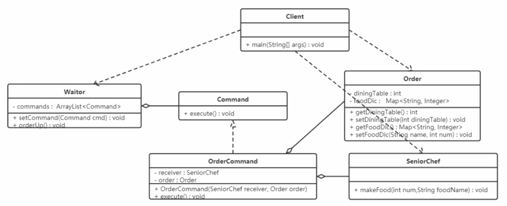

### 命令模式

将一个请求封装为一个对象，使发出请求的责任和执行请求的责任分隔开，这样两者之间通过命令对象进行沟通，
这样方便将命令对象进行存储、传递、调用、增加与管理。

#### 结构

命令模式包含以下主要角色：
- 抽象命令类（Command）：定义命令的接口，声明执行的方法
- 具体命令（Concrete Command）：具体的命令，实现命令接口；通常会持有接收者，并调用接收者的功能来完成命令要执行的操作
- 实现者/接收者（Receiver）：接收者，真正执行命令的对象。任何类都可能成为一个接收者，只要它能够实现命令要求实现的相应功能
- 调用者/请求者角色（Invoker）：要求命令对象执行请求，通常会持有命令对象，可以持有很多的命令对象，这个是客户端真正触发命令并要求执行相应操作的地方，
也就是说相当于使用命令对象的入口

#### 案例



```java
class Order {
    private int diningTable;
    private final Map<String, Integer> foodDir = new HashMap<>();
    public int getDiningTable() { return diningTable; }
    public void setDiningTable(int diningTable) { this.diningTable = diningTable; }
    public Map<String, Integer> getFoodDir() { return foodDir; }
    public void setFood(String name, int num) { foodDir.put(name, num); }
}

class SeniorChef {
    public void makeFood(String name, int num) { System.out.println(num + "份" + name); }
}

interface Command {
    void execute();
}

class OrderCommand implements Command {
    private SeniorChef receiver;
    private Order order;
    public OrderCommand(SeniorChef receiver, Order order) {
        this.receiver = receiver;
        this.order = order;
    }
    public void execute() {
        System.out.println(order.getDiningTable() + "桌的订单：");
        Map<String, Integer> foodDir = order.getFoodDir();
        Set<String> keys = foodDir.keySet();
        for (String foodName : keys) {
            receiver.makeFood(foodName, foodDir.get(foodName));
        }
        System.out.println(order.getDiningTable() + "桌的饭准备完毕");
    }
}

class Waiter {
    private List<Command> commands = new ArrayList<>();
    public void setCommand(Command command) { commands.add(command); }
    public void orderUp() {
        System.out.println("订单来了");
        for (Command command : commands) {
            if (command != null) {
                command.execute();
            }
        }
    }
}

public class Client {
    public static void main(String[] args) {
        Order order1 = new Order();
        order1.setDiningTable(1);
        order1.setFood("西红柿", 1);
        order1.setFood("小杯可乐", 2);

        Order order2 = new Order();
        order2.setDiningTable(2);
        order2.setFood("肉丝", 1);
        order2.setFood("小杯雪碧", 1);

        SeniorChef receiver = new SeniorChef();
        OrderCommand cmd1 = new OrderCommand(receiver, order1);
        OrderCommand cmd2 = new OrderCommand(receiver, order2);

        Waiter invoke = new Waiter();
        invoke.setCommand(cmd1);
        invoke.setCommand(cmd2);
        invoke.orderUp();
    }
}
```

#### 优缺点

优点：
- 降低系统的耦合度，命令模式能将调用操作的对象与实现该操作的对象解耦
- 增加或删除命令非常方便，采用命令模式增加与删除命令不会影响其他类，它满足"开闭原则"，对比扩展比较灵活
- 可以实现宏命令，命令模式可以与组合模式结合，将多个命令装配成一个组合命令，即宏命令
- 方便实现 Undo 和 Redo 操作，命令模式可以与备忘录模式结合，实现命令的撤销与恢复

缺点：
- 使用命令模式可能会导致某些系统有过多的具体命令类
- 系统结构更加复杂

#### 使用场景
- 系统需要将请求调用者和请求接收者解耦，使得调用者和接收者不直接交互
- 系统需要在不同的时间指定请求、请求排队和执行请求
- 系统需要支持命令的撤销（Undo）操作和恢复（Redo）操作

#### JDK源码解析

Runnable 是一个典型命令模式，Runnable担当命令的角色，Thread充当的是调用者，start方法就是其执行方法
