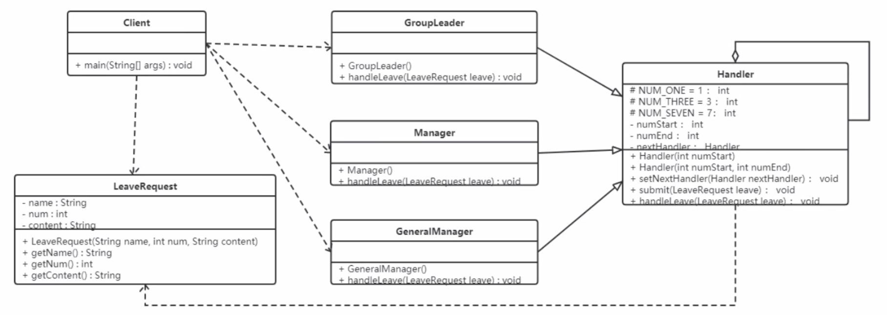

### 责任链模式

为了避免请求发送者与多个请求处理者耦合在一起，将所有请求的处理通过前一对象记住其下一个对象的引用而连成一条链；
当有请求发生时，可将请求沿着这条链传递，直到有对象处理它为止。

#### 结构
- 抽象处理者：定义一个处理请求的接口，包含抽象处理方法和一个后继连接
- 具体处理者：实现抽象处理者的处理方法，判断能够处理本次请求，如果可以处理请求则处理，否则将该请求转给它的后继者
- 客户类：创建处理链，并向链头的具体处理者对象提交请求，它不关心处理细节和请求的传递过程

#### 案例



```java
class LeaveRequest {
    private final String name;
    private final int num;
    private final String content;
    public LeaveRequest(String name, int num, String content) {
        this.name = name;
        this.num = num;
        this.content = content;
    }
    public String getName() { return name; }
    public int getNum() { return num; }
    public String getContent() { return content; }
}

abstract class Handler {
    protected final static int NUM_ONE = 1;
    protected final static int NUM_THREE = 3;
    protected final static int NUM_SEVEN = 7;

    private int numStart;
    private int numEnd;
    private Handler nextHandler;

    public Handler(int numStart) {
        this.numStart = numStart;
    }

    public Handler(int numStart, int numEnd) {
        this.numStart = numStart;
        this.numEnd = numEnd;
    }

    public Handler(Handler nextHandler) {
        this.nextHandler = nextHandler;
    }

    public void setNextHandler(Handler nextHandler) {
        this.nextHandler = nextHandler;
    }

    protected abstract void handlerLeave(LeaveRequest leaveRequest);

    public final void submit(LeaveRequest leaveRequest) {
        this.handlerLeave(leaveRequest);
        if (this.nextHandler != null && leaveRequest.getNum() > this.numEnd) {
            this.nextHandler.submit(leaveRequest);
        } else {
            System.out.println("流程结束");
        }
    }
}

class GroupLeader extends Handler {
    public GroupLeader() { super(0, Handler.NUM_ONE); }
    protected void handlerLeave(LeaveRequest leaveRequest) {
        System.out.println(leaveRequest.getName() + "请假" + leaveRequest.getNum() + "天，" +
                leaveRequest.getContent() + "。");
        System.out.println("小组长审批同意");
    }
}

class Manager extends Handler {
    public Manager() { super(Handler.NUM_ONE, Handler.NUM_THREE); }
    protected void handlerLeave(LeaveRequest leaveRequest) {
        System.out.println(leaveRequest.getName() + "请假" + leaveRequest.getNum() + "天，" +
                leaveRequest.getContent() + "。");
        System.out.println("部门经理审批同意");
    }
}

class GeneralManager extends Handler {
    public GeneralManager() { super(Handler.NUM_THREE, Handler.NUM_SEVEN); }
    protected void handlerLeave(LeaveRequest leaveRequest) {
        System.out.println(leaveRequest.getName() + "请假" + leaveRequest.getNum() + "天，" +
                leaveRequest.getContent() + "。");
        System.out.println("总经理审批同意");
    }
}

public class Client {
    public static void main(String[] args) {
        LeaveRequest leaveRequest = new LeaveRequest("leo", 7, "play");

        GroupLeader groupLeader = new GroupLeader();
        Manager manager = new Manager();
        GeneralManager generalManager = new GeneralManager();

        groupLeader.setNextHandler(manager);
        manager.setNextHandler(generalManager);

        groupLeader.submit(leaveRequest);
    }
}
```

#### 优缺点

优点：
- 降低了对象之间的耦合度：降低了请求发送者和接收者的耦合度
- 增强了系统的可扩展性：可以根据需要增加新的请求处理类，满足开闭原则
- 增强了给对象指派职责的灵活性：当工作流程发生变化，可以动态地改变链内的成员或者修改它们的次序，也可动态地新增或删除责任
- 责任链简化了对象之间的连接：一个对象只需保持一个指向其后继者的引用，不需保持其他所有处理者的引用
- 责任分担：每个类只需要处理自己该处理的工作，不能处理的传递给下一个对象完成，明确各类的责任范围，符合类的单一职责原则

缺点：
- 由于一个请求没有明确的接收者，所以不能保证它一定会被处理，该请求可能一直传到链的末端都得不到处理
- 对比较长的职责链，请求的处理可能涉及多个处理对象，系统性能将受到一定影响
- 职责链建立的合理性要靠客户端来保证，增加了客户端的复杂性，可能会由于职责链的错误设置而导致系统出错，如可能会造成循环调用

#### 源码解析

在 JavaWeb 应用开发中，FilterChain 是责任链模式的典型应用。

```java
public interface Filter {
    void doFilter(Reqeust req, Response res, FilterChain c);
}

public class FirstFilter implements Filter {
    public void doFilter(Reqeust req, Response res, FilterChain c) {
        System.out.println("过滤器1前置处理");
        chain.doFilter(req, res);
        System.out.println("过滤器1后置处理");
    }
}

public class SecondFilter implements Filter {
    public void doFilter(Reqeust req, Response res, FilterChain c) {
        System.out.println("过滤器2前置处理");
        chain.doFilter(req, res);
        System.out.println("过滤器2后置处理");
    }
}

public class FilterChain {
    private List<Filter> filters = new ArrayList<>();
    private int index = 0;
    public FilterChain addFilter(Filter filter) {
        this.filters.add(filter);
        return this;
    }
    public void doFilter(Reqeust req, Response res) {
        if (index == filters.size()) {
            return;
        }
        Filter filter = filters.get(index);
        index++;
        filter.doFilter(req, res, this);
    }
}
```

