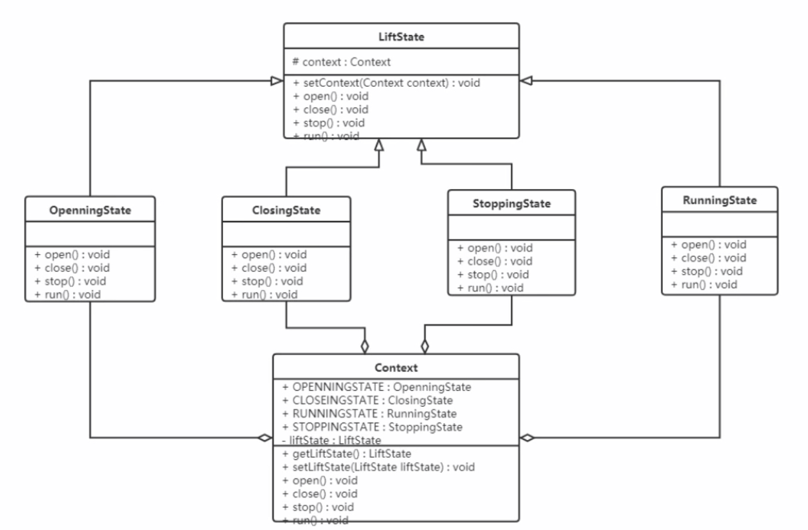

### 状态模式

对有状态的对象，把复杂的"判断逻辑"提取到不同的状态对象中，允许状态对象在其内部状态发生改变时改变其行为。

#### 结构
- 环境角色：定义了客户程序需要的接口，维护一个当前状态，并将与状态相关的操作委托给当前状态对象来处理
- 抽象状态角色：定义一个接口，用以封装环境对象中的特定状态所对应的行为
- 具体状态：实现抽象状态所对应的行为

#### 案例实现



```java
class Context {
    public final static OpeningState OPENING_STATE = new OpeningState();
    public final static ClosingState CLOSING_STATE = new ClosingState();
    public final static RunningState RUNNING_STATE = new RunningState();
    public final static StoppingState STOPPING_STATE = new StoppingState();
    private LiftState liftState;
    public LiftState getLiftState() { return liftState; }
    public void setLiftState(LiftState liftState) {
        this.liftState = liftState;
        this.liftState.setContext(this);
    }
    public void open() { this.liftState.open(); }
    public void close() { this.liftState.close(); }
    public void run() { this.liftState.run(); }
    public void stop() { this.liftState.stop(); }
}

abstract class LiftState {
    protected Context context;
    public void setContext(Context context) { this.context = context; }
    public abstract void open();
    public abstract void close();
    public abstract void run();
    public abstract void stop();
}

class ClosingState extends LiftState {
    @Override
    public void open() {
        super.context.setLiftState(Context.OPENING_STATE);
        super.context.open();
    }

    @Override
    public void close() {
        System.out.println("电梯门关闭了");
    }

    @Override
    public void run() {
        super.context.setLiftState(Context.RUNNING_STATE);
        super.context.run();
    }

    @Override
    public void stop() {
        super.context.setLiftState(Context.STOPPING_STATE);
        super.context.stop();
    }
}

class OpeningState extends LiftState {
    @Override
    public void open() {
        System.out.println("电梯开启...");
    }

    @Override
    public void close() {
        super.context.setLiftState(Context.CLOSING_STATE);
        super.context.close();
    }

    @Override
    public void run() {

    }

    @Override
    public void stop() {

    }
}

class RunningState extends LiftState {
    @Override
    public void open() {

    }

    @Override
    public void close() {

    }

    @Override
    public void run() {
        System.out.println("电梯正在运行...");
    }

    @Override
    public void stop() {
        super.context.setLiftState(Context.STOPPING_STATE);
        super.context.stop();
    }
}

public class StoppingState extends LiftState {
    @Override
    public void open() {
        super.context.setLiftState(Context.OPENING_STATE);
        super.context.open();
    }

    @Override
    public void close() {
        super.context.setLiftState(Context.CLOSING_STATE);
        super.context.close();
    }

    @Override
    public void run() {
        super.context.setLiftState(Context.RUNNING_STATE);
        super.context.run();
    }

    @Override
    public void stop() {
        System.out.println("电梯停止了...");
    }
}
```

#### 优缺点
优点：
- 将所有与某个状态有关的行为放到一个类中，并且可以方便地增加新的状态，只需要改变对象状态即可改变对象的行为
- 允许状态转换逻辑与状态对象合成一体，而不是某一个巨大的条件语句块

缺点：
- 状态模式的使用必然会增加系统类和对象的个数
- 状态模式的结构与实现都较为复杂，如果使用不当将导致程序结构和代码的混乱
- 状态模式对开闭原则的支持并不太好

#### 使用场景
- 当一个对象的行为取决于它的状态，并且它必须在运行时根据状态改变它的行为时，就可以考虑使用状态模式
- 一个操作中含有庞大的分支结构，并且这些分支决定于对象的状态时
