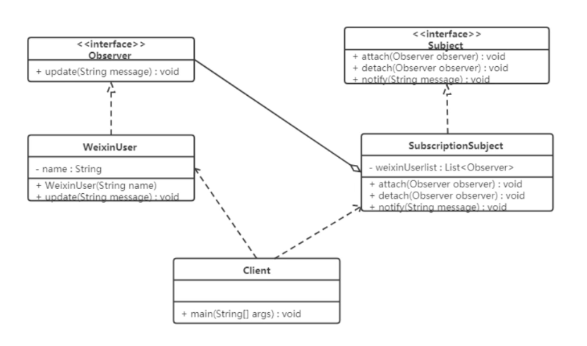

### 观察者模式

又被称为发布-订阅模式，它定义了一种一对多的依赖关系，让多个观察者对象同时监听某一个主题对象，
这个主题对象在状态变化时，会通知所有的观察者对象，使他们能够自动更新自己。

#### 结构
- 抽象主题：抽象主题角色把所有观察者对象保存在一个集合里，每个主题都可以有任意数量的观察者，
抽象主题提供一个接口，可以增加和删除观察者对象。
- 具体主题：该角色将有关状态存入具体观察者对象，在具体主题的内部状态发生改变时，给所有注册
过的观察者发送通知。
- 抽象观察者：是观察者的抽象类，它定义了一个更新接口，使得在得到主题更改通知时更新自己。
- 具体观察者：实现抽象观察者定义的更新接口，以便在得到主题更改通知时更新自身的状态。

#### 案例实现

在使用微信公众号时，当关注的公众号中有新内容更新的话，它就会推送给关注公众号的微信用户端。
使用观察者模式来模拟这样的场景，微信用户就是观察者，微信公众号是被观察者，



```java
interface Observer {
    void update(String message);
}

class SubscriptionSubject implements Subject {
    private final List<Observer> weiXinUserList = new ArrayList<>();
    public void attach(Observer observer) { weiXinUserList.add(observer); }
    public void detach(Observer observer) { weiXinUserList.remove(observer); }
    public void notify(String message) {
        for (Observer observer : weiXinUserList) {
            observer.update(message);
        }
    }
}

interface Subject {
    void attach(Observer observer);
    void detach(Observer observer);
    void notify(String message);
}

class WeixinUser implements Observer {
    private String name;
    public WeixinUser(String name) { this.name = name; }
    public void update(String message) { System.out.println(name + "-" + message); }
}
```

#### 优缺点

1. 优点
- 降低了目标与观察者之间的耦合关系，两者之间的关系是抽象耦合关系
- 被观察者发送通知，所有注册的观察者都会收到信息【可以实现广播机制】

2. 缺点
- 如果观察者非常多的话，那么所有的观察者收到被观察者发送的通知会耗时
- 如果被观察者有循环依赖的话，那么被观察者发送通知会使观察者循环调用，会导致系统崩溃

#### 使用场景

- 对象间存在一对多关系，一个对象的状态发生改变会影响其他对象
- 当一个抽象模型有两个方面，其中一个方面依赖于另一方面时

#### JDK 提供的实现

在 Java 中，通过 `java.util.Observable` 类和 `java.util.Observer` 接口定义了观察者模式，
只要实现它们的子类就可以编写观察者模式实例。

1. Observable 类

Observable 类是抽象目标类，它有一个 Vector 集合成员变量，用于保存所有要通知的观察者对象
- `void addObserver(Observer o)`：用于将新的观察者对象添加到集合中
- `void notifyObservers(Object arg)`：调用集合中的所有观察者对象的 update 方法，通知它们数据发生改变
- `void setChange()`：用来设置一个 boolean 类型的内部标注，注明目标对象发生了变化。
当它为 true 时，`notifyObservers()` 才会通知观察者

2. Observer 接口

Observer 接口是抽象观察者，它监视目标对象的变化，当目标对象发生变化时，观察者得到通知，并调用 update 方法，进行相应的工作


