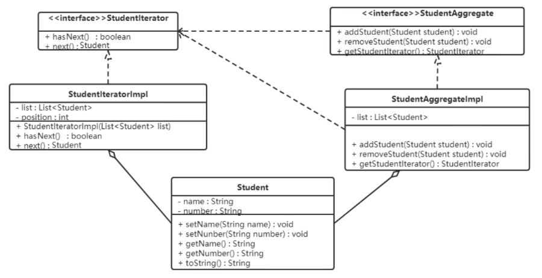

### 迭代器模式

提供一个对象来顺序访问聚合对象中的一系列数据，而不暴露聚合对象的内部表示。

#### 结构
- 抽象聚合：定义存储、添加、删除聚合元素以及创建迭代器对象的接口
- 具体聚合：实现抽象聚合类，返回一个具体迭代器的实例
- 抽象迭代器：定义访问和遍历聚合元素的接口，通常包含 `hasNext()`、`next()` 等方法
- 具体迭代器：实现抽象迭代器接口中所定义的方法，完成对聚合对象的遍历，记录遍历的当前位置

#### 案例实现

定义一个可以存储学生对象的容器对象，将遍历该容器的功能交由迭代器实现，涉及到的类如下：



```java
class Student {
    private String name;
    private Integer number;

    public Student(String name, Integer number) {
        this.name = name;
        this.number = number;
    }

    public String getName() {
        return name;
    }

    public void setName(String name) {
        this.name = name;
    }

    public Integer getNumber() {
        return number;
    }

    public void setNumber(Integer number) {
        this.number = number;
    }

    @Override
    public String toString() {
        return new StringJoiner(", ", Student.class.getSimpleName() + "[", "]")
                .add("name='" + name + "'")
                .add("number='" + number + "'")
                .toString();
    }
}

interface StudentIterator {
    boolean hasNext();
    Student next();
}

class StudentIteratorImpl implements StudentIterator {
    private List<Student> list;
    private int position = 0;
    public StudentIteratorImpl(List<Student> list) { this.list = list; }
    public boolean hasNext() { return position < list.size(); }
    public Student next() { return list.get(position++); }
}

interface StudentAggregate {
    void addStudent(Student stu);
    void removeStudent(Student stu);
    StudentIterator getStudentIterator();
}

class StudentAggregateImpl implements StudentAggregate {
    private List<Student> list = new ArrayList<>();
    public void addStudent(Student stu) { list.add(stu); }
    public void removeStudent(Student stu) { list.remove(stu); }
    public StudentIterator getStudentIterator() { return new StudentIteratorImpl(list); }
}
```
