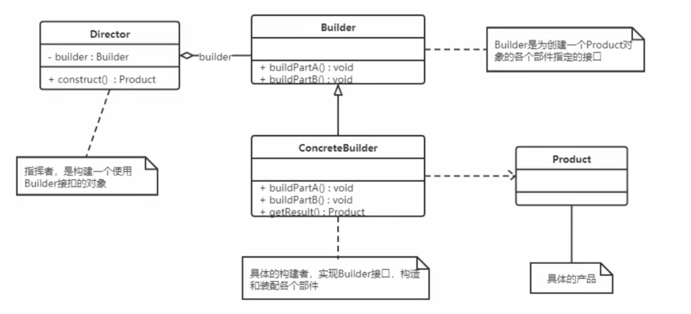

建造者模式包含如下角色：
- 抽象建造者类：这个接口规定要实现复杂对象的那些部分的创建，并不设计具体的对象部件的构建。
- 具体建造者类：实现 Builder 接口，完成复杂产品的哥哥部件的具体创建方法。在构造过程完成后，提供产品的实例
- 产品类：要创建的复杂对象
- 指挥者类：调用具体建造者来创建复杂对象的各个部分，在指导者中不涉及具体产品的信息，只负责保证对象各部分完整创建或按某种顺序创建



```java
class Bike {
    private String frame;
    private String seat;
    public String getFrame() { return frame; }
    public void setFrame(String frame) { this.frame = frame; }
    public String getSeat() { return seat; }
    public void setSeat(String seat) { this.seat = seat; }
}

abstract class Builder {
    protected Bike bike = new Bike();
    public abstract void buildFrame();
    public abstract void buildSeat();
    public abstract Bike createBike();
}

class MobileBuilder extends Builder {
    public void buildFrame() { bike.setFrame("碳纤维车架"); }
    public void buildSeat() { bike.setSeat("真皮车座"); }
    public Bike createBike() { return bike; }
}

class OfoBuilder extends Builder {
    public void buildFrame() { bike.setFrame("铝合金车架"); }
    public void buildSeat() { bike.setSeat("橡胶车座"); }
    public Bike createBike() { return bike; }
}

class Director {
    private Builder builder;
    public Director(Builder builder) { this.builder = builder; }
    public Bike construct() {
        builder.buildFrame();
        builder.buildSeat();
        return builder.createBike();
    }
}
```

优点：
- 建造者模式的封装性很好。使用建造者模式可以有效的封装变化，在使用建造者模式的场景中，一般产品类和建造者类是比较稳定的。
因此，将主要的业务逻辑封装在指挥者类中对整体而言可以取得比较好的稳定性。
- 在建造者模式中，客户端不必要知道产品内部组成的细节，将产品本身与产品的创建过程解耦，使得相同的创建过程可以创建不同的产品对象。
- 可以更加精细地控制产品的创建过程。将复杂产品的创建步骤分解在不同的方法中，使得创建过程更加清晰，也更方便使用程序来控制创建过程。
- 建造者模式很容易扩展。如果有新的需求，通过实现一个新的建造者类就可以完成，基本上不用修改之前已经测试通过的代码，因此不会对原有功能引入风险。

缺点：
- 建造者所创建的产品具有较多的共同点，其组成部分相似，如果产品之间的差异性很大，则不适合使用建造者模式，因此其使用范围受到一定的限制。

使用场景：
- 创建的对象较复杂，由多个部件构成，各部件面临着复杂的变化，但构件间的建造顺序是稳定的。
- 创建复杂对象的算法独立于该对象的组成部分以及它们的装配方式，即产品的构建过程和最终的表示是独立的。


