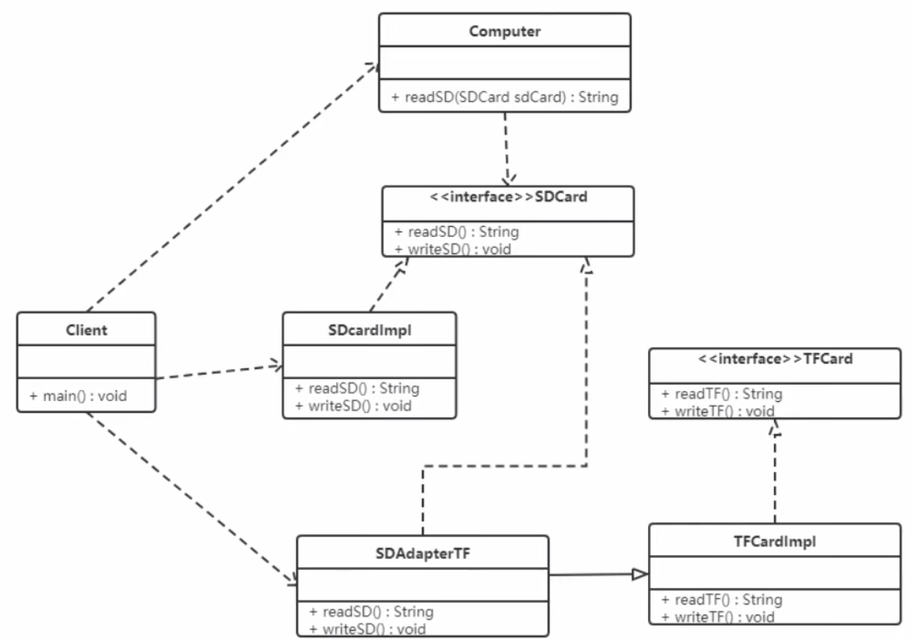
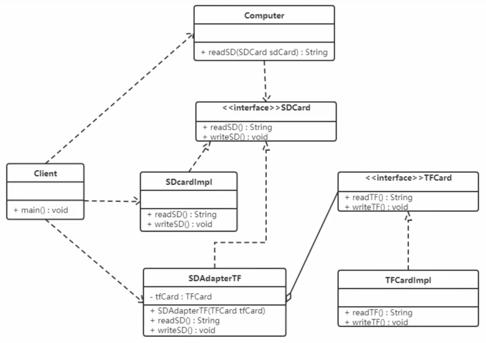
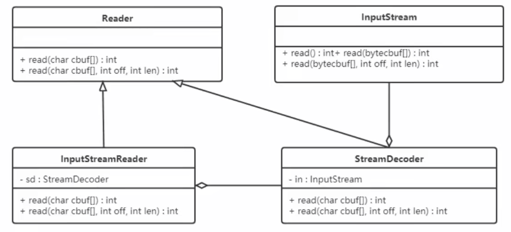

### 适配器模式

适配器模式（Adapter）包含以下主要角色：
- 目标接口：当前系统业务所期待的接口，它可以是抽象类或接口
- 适配者类：它是被访问和适配的现存组件库中的组件接口
- 适配器类：它是一个转换器，通过继承或引用适配者的对象，把适配者接口转换成目标接口，让客户按目标接口的格式访问适配者

#### 类适配器模式

实现方式：定义一个适配器类来实现当前系统的业务接口，同时又继承现有组件库中已经存在的组件

例如：现有一台电脑只能读取 SD 卡，而要读取 TF 卡中的内容的话就需要使用到适配器模式。创建一个读卡器，将 TF 卡中的内容读取出来。



```java
interface TFCard {
    String readTF();
    void writeTF(String msg);
}

class TFCardImpl implements TFCard {
    public String readTF() { return "TFCard read msg"; }
    public void writeTF(String msg) { System.out.println("TFCard write msg: " + msg); }
}

interface SDCard {
    String readSD();
    void writeSD(String msg);
}

class SDCardImpl implements SDCard {
    public String readSD() { return "SDCard read msg"; }
    public void writeSD(String msg) { System.out.println("SDCard write msg: " + msg); }
}

class SDAdapterTF extends TFCardImpl implements SDCard {
    public String readSD() {
        System.out.println("adapter read TFCard");
        return readTF();
    }
    public void writeSD(String msg) {
        System.out.println("adapter write TFCard");
        writeTF(msg);
    }
}

class Computer {
    public String readSD(SDCard sdCard) {
        if (sdCard == null) {
            throw new NullPointerException("SDCard is not null");
        }
        return sdCard.readSD();
    }

    public void writeSD(SDCard sdCard, String msg) {
        sdCard.writeSD(msg);
    }
}

public class Client {
    public static void main(String[] args) {
        Computer computer = new Computer();
        String msg = computer.readSD(new SDCardImpl());
        System.out.println(msg);

        System.out.println(computer.readSD(new SDAdapterTF()));
    }
}
```

类适配器模式违背了合成复用原则。类适配器是客户端有一个接口规范的情况下可用，反之不可用。

#### 对象适配器模式

对象适配器模式可采用将现有组件库中已经实现的组件引入适配器类中，该类同时实现当前系统的业务接口



```java
interface TFCard {
    String readTF();
    void writeTF(String msg);
}

class TFCardImpl implements TFCard {
    public String readTF() { return "TFCard read msg"; }
    public void writeTF(String msg) { System.out.println("TFCard write msg: " + msg); }
}

interface SDCard {
    String readSD();
    void writeSD(String msg);
}

class SDCardImpl implements SDCard {
    public String readSD() { return "SDCard read msg"; }
    public void writeSD(String msg) { System.out.println("SDCard write msg: " + msg); }
}

class SDAdapterTF implements SDCard {
    private final TFCard tfCard;
    public SDAdapterTF(TFCard tfCard) { this.tfCard = tfCard; }
    public String readSD() {
        System.out.println("adapter read TFCard");
        return tfCard.readTF();
    }
    public void writeSD(String msg) {
        System.out.println("adapter write TFCard");
        tfCard.writeTF(msg);
    }
}

class Computer {
    public String readSD(SDCard sdCard) {
        if (sdCard == null) { throw new NullPointerException("SDCard is not null"); }
        return sdCard.readSD();
    }
    public void writeSD(SDCard sdCard, String msg) { sdCard.writeSD(msg); }
}

public class Client {
    public static void main(String[] args) {
        Computer computer = new Computer();
        String msg = computer.readSD(new SDCardImpl());
        System.out.println(msg);

        System.out.println(computer.readSD(new SDAdapterTF(new TFCardImpl())));
    }
}
```

当不希望实现一个接口中所有的方法时，可以创建一个抽象类 Adapter，实现所有方法。而此时我们只需要继承该抽象类即可。

#### 应用场景
- 以前开发的系统存在满足新系统功能需求的类，但其接口同新系统的接口不一致
- 使用第三方提供的组件，但组件接口定义和自己要求的接口定义不同

#### JDK 源码解析

Reader（字符流）、InputStream（字节流）的适配使用的是 InputStreamReader。 InputStreamReader 继承自 java.io 包中的 Reader。



从类图中可以看出：
- InputStreamReader 是对同样实现了 Reader 的 StreamDecoder 的封装 
- StreamDecoder 不是 Java SE API 中的内容，是 Sun JDK 给出的自身实现，
它们对构造方法中的字节流类（InputStream）进行封装，并通过该类进行了字节流和字符流之间的解码转换。

结论：

从表层来看，InputStreamReader 做了 InputStream 字节流类到 Reader 字符流之间的转换。
而从如上 Sun JDK 中的实现类关系结构中可以看出，是 StreamDecoder 的设计实现在实际上采用了适配器模式。


