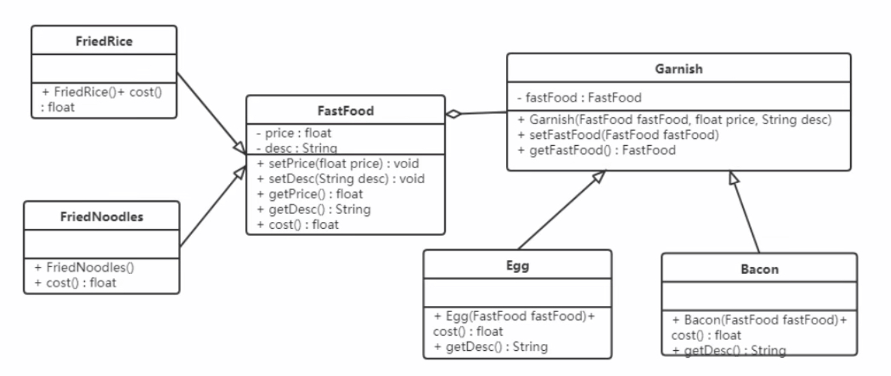
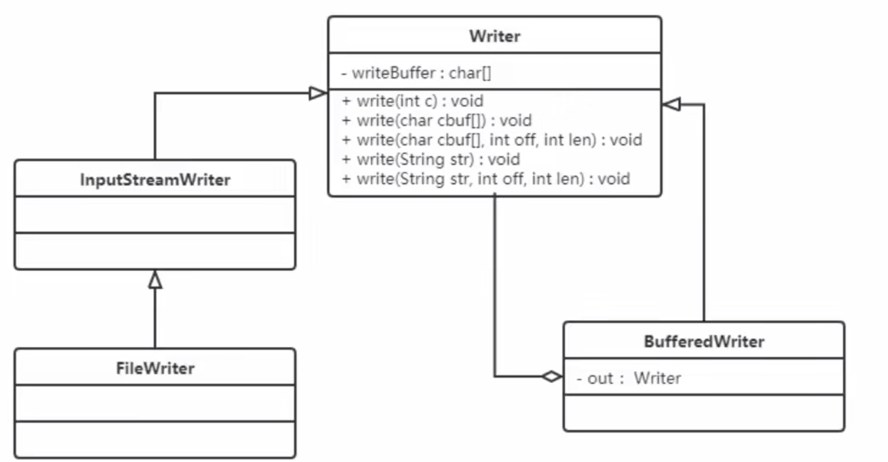

### 装饰者模式

#### 结构

装饰模式中的角色：
- 抽象角色：定义一个抽象接口以规范准备接收附加责任的对象
- 具体构件角色：实现抽象构建，通过装饰角色为其添加一些指责
- 抽象装饰角色：继承或实现抽象构建，并包含具体构件的实例，可以通过其子类扩展具体构件的功能
- 具体装饰角色：实现抽象装饰的相关方法，并给具体构件对象添加附加的责任



```java
abstract class FastFood {
    private float price;
    private String desc;
    public FastFood() {}
    public FastFood(float price, String desc) {
        this.price = price;
        this.desc = desc;
    }
    public float getPrice() { return price; }
    public void setPrice(float price) { this.price = price; }
    public String getDesc() { return desc; }
    public void setDesc(String desc) { this.desc = desc; }
    public abstract float cost();
}

class FriedRice extends FastFood {
    public FriedRice() { super(10, "炒饭"); }
    public float cost() { return getPrice(); }
}

class FriedNoodles extends FastFood {
    public FriedNoodles() { super(12, "炒面"); }
    public float cost() { return getPrice(); }
}

abstract class Garnish extends FastFood {
    private FastFood fastFood;
    public Garnish(float price, String desc, FastFood fastFood) {
        super(price, desc);
        this.fastFood = fastFood;
    }
    public FastFood getFastFood() { return fastFood; }
    public void setFastFood(FastFood fastFood) { this.fastFood = fastFood; }
}

class Egg extends Garnish {
    public Egg(FastFood fastFood) { super(1, "鸡蛋", fastFood); }
    public float cost() { return getPrice() + getFastFood().cost(); }
    public String getDesc() { return super.getDesc() + getFastFood().getDesc(); }
}

class Bacon extends Garnish {
    public Bacon(FastFood fastFood) { super(2, "培根", fastFood); }
    public float cost() { return getPrice() + getFastFood().cost(); }
    public String getDesc() { return super.getDesc() + getFastFood().getDesc(); }
}
```

好处：
- 装饰者模式可以带来比继承更加灵活性的扩展功能，使用更加方便，可以通过组合不同的装饰者对象来获取具有不同行为状态的多样化结果。
装饰者模式比继承更具良好的扩展性，完美的遵循开闭原则，继承是静态的附加责任，装饰者则是动态的附加责任。
- 装饰类和被装饰者类可以独立发展，不会相互耦合，装饰器模式是继承的一个替代模式，装饰模式可以动态扩展一个实现类的功能。

#### 使用场景
- 当不能采用继承的方式对系统进行扩充或者采用继承不利于系统扩展和维护时
  1. 系统中存在大量独立的扩展，为支持每一种组合将产生大量的子类，使得子类数目呈爆炸性增长
  2. 类定义不能继承
- 在不影响其他对象的情况下，以动态、透明的方式给单个对象添加指责
- 当对象的功能要求可以动态地添加，也可以再动态地撤销

#### JDK 源码解析

IO 流中的包装类使用到了装饰者模式。BufferedInputStream, BufferedOutputStream, BufferedReader, BufferedWriter



BufferedWriter 使用装饰者模式对 Writer 子实现类进行了增强，添加了缓冲区，提高了写数据的效率

#### 代理和装饰者的区别

静态代理和装饰者模式的区别：
- 相同点
  - 都要实现与目标类相同的业务接口
  - 在两个类中都要声明目标对象
  - 都可以在不修改目标类的前提下增强目标方法
- 不同点
  - 目的不同：装饰者是为了增强目标对象，静态代理是为了保护和隐藏目标对象
  - 获取目标对象构件的地方不同：装饰者是由外界传递进来，可以通过构造方法传递；静态代理是在代理内部创建，以此来隐藏目标对象


