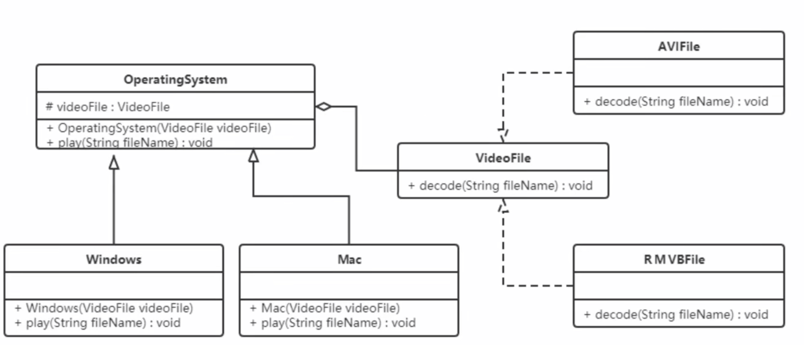

### 桥接模式

将抽象与实现分离，使它们可以独立变化，它是用组合关系代替继承关系来实现，从而降低了抽象和实现这两个可变维度的耦合度

#### 结构

桥接模式包含以下主要角色：
- 抽象化角色：定义抽象类，并包含一个对实现化对象的引用
- 扩展抽象化角色：是抽象化角色的子类，实现父类中的业务方法，并通过组合关系调用实现化角色中的业务方法
- 实现化角色：定义实现化角色的接口，供扩展抽象化角色调用
- 具体实现化角色：给出实现化角色接口的具体实现

#### 案例

视频播放器：跨平台的视频播放器，可以在不同操作系统平台上播放多种格式的视频文件，常见的视频格式包括 RMVB、AVI、WMV 等。
该播放器包含了两个维度，适合使用桥接模式。



```java
interface VideoFile {
    void decode(String fileName);
}

class AviFile implements VideoFile {
    public void decode(String fileName) { System.out.println("avi视频文件: " + fileName); }
}

class RmvbFile implements VideoFile {
    public void decode(String fileName) { System.out.println("rmvb视频文件: " + fileName); }
}

abstract class OperatingSystem {
    protected VideoFile videoFile;
    public OperatingSystem(VideoFile videoFile) { this.videoFile = videoFile; }
    public abstract void play(String fileName);
}

public class Windows extends OperatingSystem {
    public Windows(VideoFile videoFile) { super(videoFile); }
    public void play(String fileName) { videoFile.decode(fileName); }
}

public class Mac extends OperatingSystem {
    public Mac(VideoFile videoFile) { super(videoFile); }
    public void play(String fileName) { videoFile.decode(fileName); }
}

public class Client {
    public static void main(String[] args) {
        OperatingSystem mac = new Mac(new AviFile());
        mac.play("a.avi");
        OperatingSystem windows = new Windows(new RmvbFile());
        windows.play("a.rmvb");
    }
}
```

好处：
- 桥接模式提高了系统的可扩展性，在两个变化维度中任意扩展一个维度，都不需要修改原有系统
  - 如：现在还有一种视频文件wmv，我们只需要再定义一个类实现 VideoFile 接口即可，其他类不需要发生变化
- 实现细节对客户透明

#### 使用场景
- 当一个类存在两个独立变化的维度，且这两个维度都需要进行扩展时。
- 当一个系统不希望使用继承或因为多层次继承导致系统类的个数急剧增加时
- 当一个系统需要在构件的抽象化角色和具体化角色之间增加更多的灵活性时。
避免在两个层次之间建立静态的继承联系，通过桥接模式可以使它们在抽象层建立一个关联关系。


