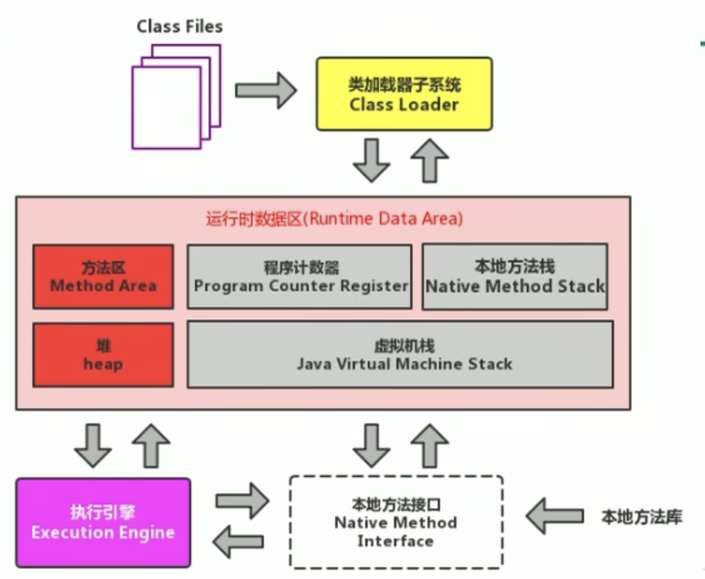
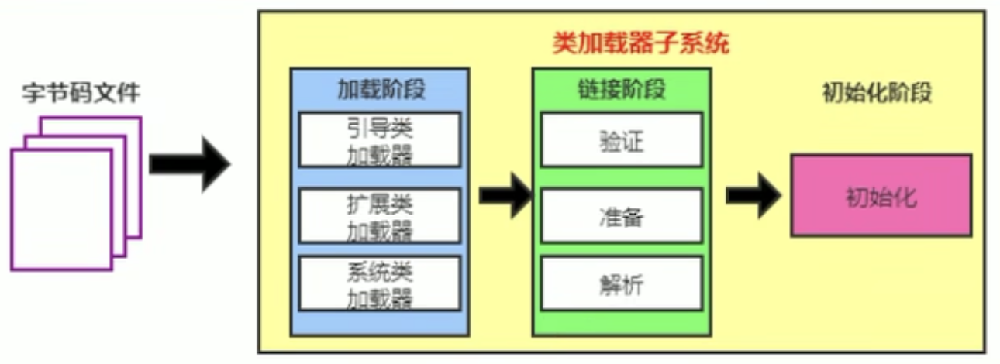
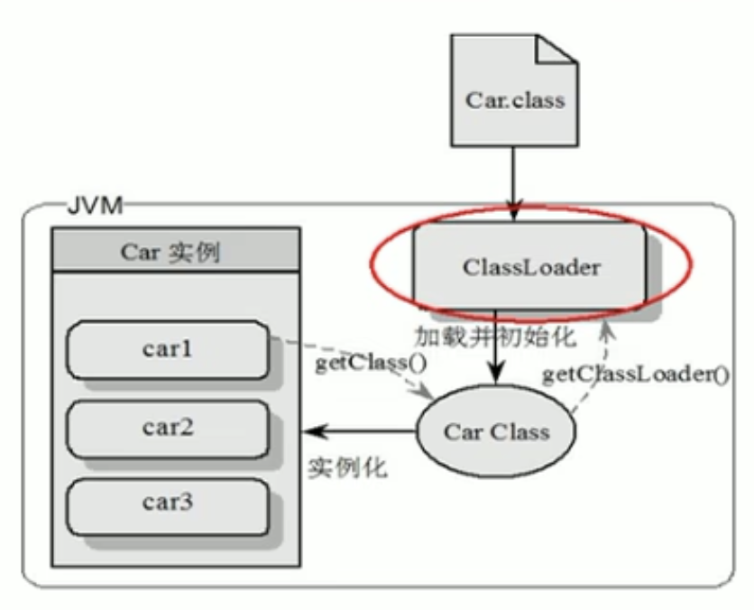
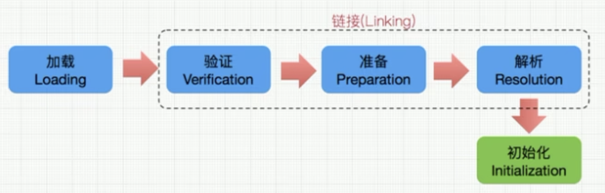
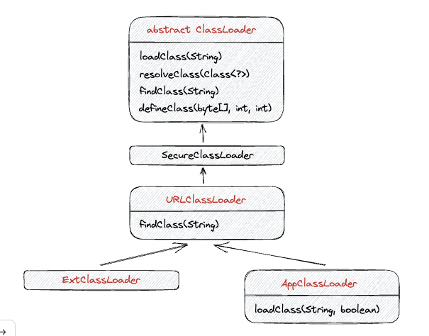
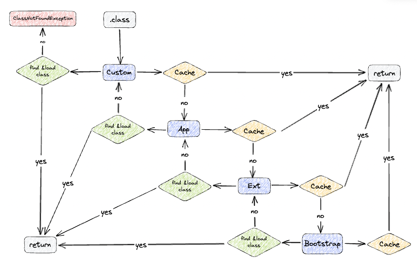

### 类加载子系统
#### 0 - 内存结构概述

<div align=center>

</div>

#### 1 - 类加载器与类的加载过程

<div align=center>

</div>

1. 类加载器子系统负责从文件系统或者网络中加载 Class 文件，class 文件在文件开头有特定的文件标识
2. **ClassLoader 只负责 class 文件的加载，至于它是否可以运行，则由 Execution Engine 决定。**
3. 加载的类信息存放于一块称为方法区的内存空间。除了类的信息外，方法区中还会存放运行时常量池信息，
可能还包括字符串字面量和数字常量（这部分常量信息是 Class 文件中常量池部分的内存映射）

<div align=center>

</div>

1. class file 存在于本地硬盘上，最终目的是加载到 JVM 中实例化出 n 个一摸一样的实例
2. class file 加载到 JVM 中，被称为 **DNA 元数据模版**，放在**方法区**
3. 在 .class 文件 -> JVM -> 最终称为元数据模版，此过程要一个运输工具就是 **ClassLoader**

<div align=center>

</div>

1. 加载
   1. 通过一个类的全限定名获取定义此类的二进制字节流
   2. 将这个字节流所代表的静态存储结构转化为方法区的运行时数据结构
   3. **在内存中生成一个代表这个类的 `java.lang.Class` 对象**，作为方法区这个类的各种数据访问的入口
2. 链接
   1. 验证
      - 目前在于确保 Class 文件的字节流中包含信息符合当前虚拟机要求，保证被加载类的正确性，不会危害虚拟机自身安全
      - 主要包括四种验证：文件格式验证 (CAFE BABY)、元数据验证，字节码验证，符号引用验证
   2. 准备
      - **为类变量分配内存并且设置该类变量的默认初始值，即零值**
      - **这里不包含用 final 修饰的 static，因为 <u>final 在编译的时候就会分配了，准备阶段会显式初始化</u>**
      - 这里不会为实例变量分配初始化，类变量会分配在方法区中，而实例变量是会随着对象一起分配到 Java 堆中
   3. 解析
      - **将常量池内的符号引用转换为直接引用的过程**
3. 初始化
   - 执行类**构造器方法** `<clinit>()` 的过程
   - 此方法不需要定义，是 javac 编译器自动收集类中的 **所有类变量的赋值动作和静态代码块** 中的语句合并而来
   - 构造器方法中指令按语句在源文件中出现的顺序执行
   - `<clinit>()` 不同于类的构造器 `<init>()`
   - 若该类有父类，JVM 会保证子类的 `<clinit>()` 执行前，父类的 `<clinit>()` 已经执行完毕
   - **虚拟机必须保证一个类的 `<clinit>()` 方法在多线程下被同步加锁**

#### 2 - 类加载器分类

JVM 支持两种类型的类加载器，分别为**引导类加载器 (Bootstrap ClassLoader) 和自定义类加载器 (User-Defined ClassLoader)**

自定义类加载器一般指的是程序中由开发人员自定义的一类类加载器，但是 Java 虚拟机规范却没有这么定义，
而是将所有派生于抽象类 ClassLoader 的类加载器都划分为自定义类加载器。

无论类加载器的类型如何划分，在程序中最常见的类加载器始终只有 3 个
 
##### 2.1 - 虚拟机自带的加载器

<u>类加载器的范围可以从 `sun.misc.Launcher` 中看到</u>: 
- 启动类加载器（引导类加载器，Bootstrap ClassLoader）
  - **这个类加载使用 C/C++ 语言实现的**，嵌套在 JVM 内部
  - 它用来加载 Java 的核心库，用于提供 JVM 自身需要的类
  - 并不继承自 `java.lang.ClassLoader`，没有父加载器
  - 加载扩展类和应用程序加载器，并指定为他们的父类加载器
  - 出于安全考虑，Bootstrap 启动类加载器只加载包名为 java、javax、sun 等开头的类
- 扩展类加载器 (Extension ClassLoader)
  - Java 语言编写
  - 派生于 ClassLoader 类
  - 父类加载器为启动类加载器
  - 从 java.ext.dirs 系统属性所指定的目录中加载类库，或从 JDK 的安装目录的 jre/lib/ext 子目录下加载类库
- 应用程序类加载器（系统类加载器，AppClassLoader）
  - java 语言编写，由 `sun.misc.Launcher$AppClassLoader` 实现
  - 派生于 ClassLoader 类
  - 父类加载器为扩展类加载器
  - 它负责加载环境变量 classpath 或系统属性 java.class.path 指定路径下的类库
  - 该类加载是程序中默认的类加载器，Java 应用的类都是由它来完成加载
  - 通过 `ClassLoader.getSystemClassLoader()` 方法可以获取到该类加载器

##### 2.2 - 用户自定义类加载器

通常在手写框架、类库时使用（Tomcat、Spring）

目的：
- **隔离加载类**: 在同一个工程中，引入了多个框架，可能会出现某些类的路径一样、类名相同，使用自定义类加载器可以解决类的冲突
- **修改类加载的方式: 在需要加载类的时候进行动态加载**
- 扩展加载源: 除了从本地磁盘、网络中加载 class 文件，还可以从数据库、机顶盒中加载 class 文件
- 防止源码泄漏: java文件容易被篡改

用户自定义类加载器实现步骤:
1. 通过继承抽象类 `java.lang.ClassLoader` 类的方式，实现自定义的类加载器
2. 不建议重写 `loadClass()` 方法，而是把自定义的类加载逻辑写在 `findClass()` 方法中
3. 如果没有太复杂的需求，可以直接继承 URLClassLoader 类，避免编写 `findClass()` 方法及其获取字节码流的方式

#### 3 - ClassLoader 的使用

ClassLoader 类，它是一个抽象类，其后所有的类加载器都继承自 ClassLoader（不包括启动类加载器）
- `getParent()`: 返回该类加载器的超类加载器
- `loadClass(String name)`: 加载名为 name 的类，返回结果为 `java.lang.Class` 类的实例
- `findClass(String name)`: 查找名为 name 的类，返回结果为 `java.lang.Class` 类的实例
- `defineClass(String name, byte[] b, int off, int len)`: 把字节数组转换为一个 Java 类，返回结果为 `java.lang.Class` 类的实例
- `findLoadedClass(String name)`: 查找名为 name 的已经被加载过的类，返回结果为 `java.lang.Class` 类的实例
- `resolveClass(Class<?> c)`: 连接指定的一个 Java 类

<div align=center>

</div>

##### 3.1 - 获取 ClassLoader 的途径

1. 获取当前类的 ClassLoader: `clazz.getClassLoader()`
2. 获取当前线程上下文的 ClassLoader: `Thread.currentThread().getContextClassLoader()`
3. 获取当前系统的 ClassLoader: `ClassLoader.getSystemClassLoader()`
4. 获取调用者的 ClassLoader：`DriverManager.getCallerClassLoader()`

#### 4 - 双亲委派机制（重点）

JVM 对 class 文件采用的是 **按需加载（懒加载）** 的方式，也就是当需要使用该类时才会将它的 class 文件加载到内存生成 class 对象。
而且加载某个类的 class 文件时，Java 虚拟机采用的是 **双亲委派模式**，即把请求交给父类处理，它是一种**任务委派模式**。

<div align=center>

</div>

工作原理:
1. 如果一个类加载器收到了类加载请求，它如果没有自己加载过，就把这个请求委托给父类的加载器去执行
2. 如果父类加载器还存在其父类加载器，则进一步向上委托，依次递归，请求最终将到达顶层的启动类加载器
3. 如果父类加载器可以完成类加载任务，就成功返回，倘若父类加载器无法完成此加载任务，子加载器才会尝试自己去加载

**优势（重点）**:
- **避免类的重复加载**（父类加载器加载了，就不会让它的子类加载器加载）
- **保护程序安全，防止核心 API 被随意篡改**（不会覆盖已有的类，也不会使新建的类被加载）

<u>沙箱安全机制</u>：
自定义 String 类，但是在加载自定义 String 类的时候会率先使用引导类加载器加载，
而引导类加载器在加载的过程中会先加载 jdk 自带的文件 (rt.jar 包中的 java.lang.String.class)
这样可以保证对 java 核心源代码的保护，这就是沙箱安全机制。

双亲委派源码，写在 ClassLoader 抽象类的 loadClass 方法中:
```java
// java/lang/ClassLoader.java
protected Class<?> loadClass(String name, boolean resolve)
    throws ClassNotFoundException
{
    // 加锁，只能有一个线程加载类
    synchronized (getClassLoadingLock(name)) {
        // First, check if the class has already been loaded
        Class<?> c = findLoadedClass(name);
        if (c == null) {
            long t0 = System.nanoTime();
            try {
                if (parent != null) {
                    // 递归向上访问父加载器
                    c = parent.loadClass(name, false);
                } else {
                    c = findBootstrapClassOrNull(name);
                }
            } catch (ClassNotFoundException e) {
            }

            if (c == null) {
                // If still not found, then invoke findClass in order
                // to find the class.
                // 自定义类加载器
                long t1 = System.nanoTime();
                c = findClass(name);

                // this is the defining class loader; record the stats
                sun.misc.PerfCounter.getParentDelegationTime().addTime(t1 - t0);
                sun.misc.PerfCounter.getFindClassTime().addElapsedTimeFrom(t1);
                sun.misc.PerfCounter.getFindClasses().increment();
            }
        }
        if (resolve) {
            resolveClass(c);
        }
        return c;
    }
}
```

#### * 5 - 类的主动使用与被动使用

在 JVM 中表示两个 class 对象是否为同一个类存在两个必要条件:
- 类的完整类名必须一致，包括包名
- 加载这个类的 ClassLoader（指 ClassLoader 实例对象）必须相同

在 JVM 中，即使这两个类对象来源同一个 class 文件，被同一个虚拟机所加载，但只要加载它们的 ClassLoader
实例对象不同，那么这两个类对象也是不想等的。

##### 5.1 - 对类加载器的引用

JVM 必须知道一个类型是由启动加载器加载的还是由用户类加载器加载的。如果一个类型是由用户类加载器加载的，
那么 JVM 会**将这个类加载器的一个引用作为类型信息的一部分保存在方法区中。**
当解析一个类型到另一个类型的引用的时候，JVM 需要保证这两个类型的类加载器是相同的。

##### 5.2 - 主动使用的情况
1. 创建类的实例
2. 访问某个类或接口的静态变量，或者对该静态变量赋值
3. 调用类的静态方法
4. 反射（比如: Class.forName("com.shu.Test")）
5. 初始化一个类的子类
6. Java 虚拟机启动时被标明为启动类的类
7. JDK7 开始提供的动态语言支持

除了以上七种情况，其他使用 Java 类的方式都被看作是对类的被动使用，都不会导致类的初始化。

#### * 6 - 编译阶段

混合执行（默认）: 只编译热点代码，通过循环计数器等，找到热点代码

编译执行: 启动慢，执行快

解释执行: 启动快，执行慢
