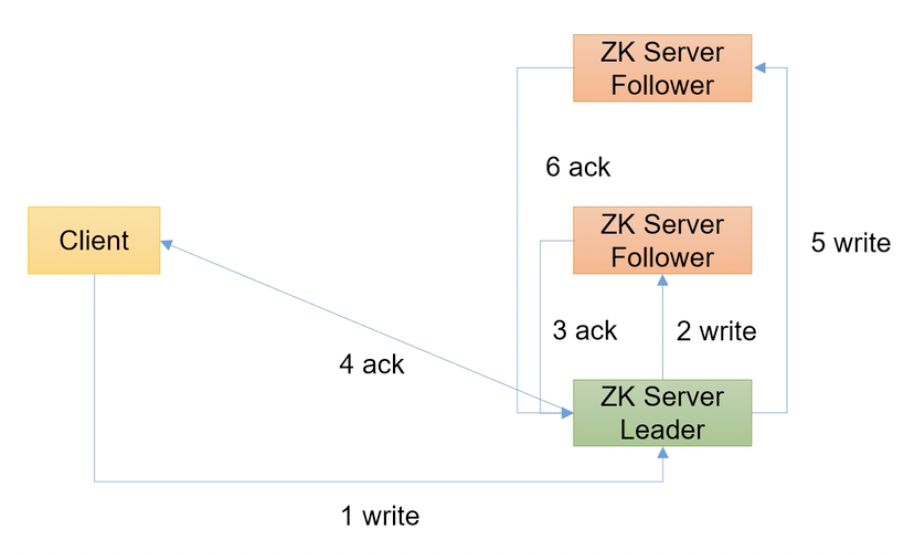
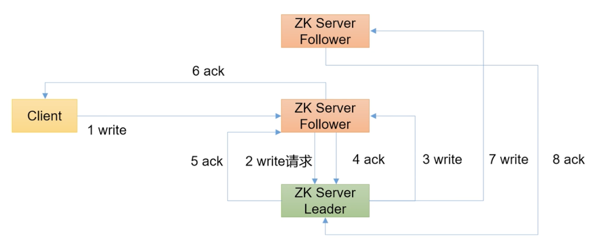

1. Client 给 Leader 发送数据
2. Leader 向 Follower 同步数据
3. Follower 向 Leader 返回确认
4. 当有超过半数的 Zookeeper 节点同步数据，Leader 向 Client 返回确认
5. Leader 给未同步过该数据的节点同步数据
6. Follower 向 Leader 返回确认

1. Client 给 Follower* 发送数据
2. Follower* 将数据发送给 Leader
3. Leader 将数据发送给其余 Follower
4. 成功接收的 Follower 向 Leader 返回确认
5. 当有超过半数的 Zookeeper 节点同步数据，Leader 向 Follower* 返回确认
6. Follower* 给 Client 返回确认
7. Leader 将数据发送给其余 Follower
8. 成功接收的 Follower 向 Leader 返回确认

