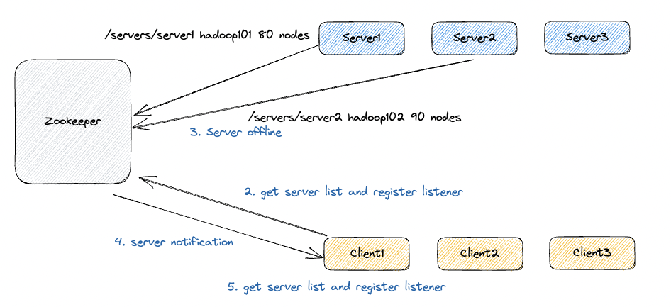

### 服务端动态上下线

客户端能实时洞察到服务器的上下线变化

1. 服务端启动时去注册信息（创建都是临时节点）
2. Client 获取服务器的上线列表并注册监听
3. 如果有一台服务器下线
4. Zookeeper 通知 Client 服务器上下线信息
5. Client 重新获取服务器的上线列表并注册监听

Server 和 Client 对于 Zookeeper 来说都是客户端，区别在于：Server 在 Zookeeper 上创建节点，而 Client 访问 Zookeeper 上的节点

