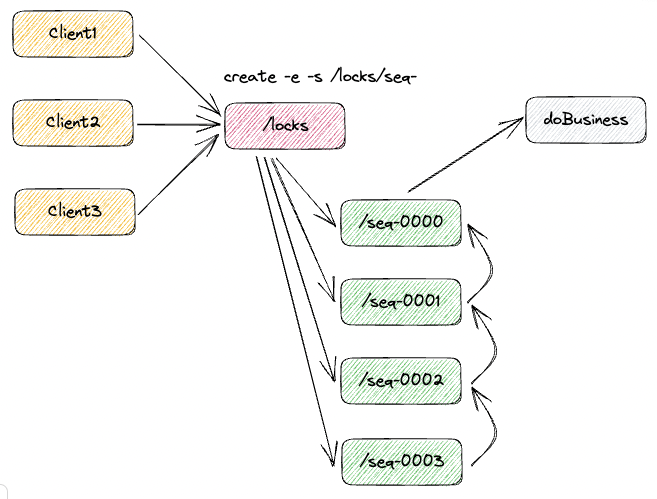

1. 接收到请求后，在 /locks 节点下创建一个临时顺序节点
2. 判断自己是不是当前节点下最小的节点：是，获取到锁；不是，对前一个节点进行监听
3. 获取到锁，处理完业务后，删除节点释放锁，然后下面的节点将收到通知，重复第二步判断

原生 Java API 开发存在的问题
- 会话连接是异步的，需要自己去处理，例如使用 `CountDownLatch`
- Watch 需要重复注册，不然就不能生效
- 开发的复杂度高
- 不支持多节点的删除和创建，需要自己去递归
